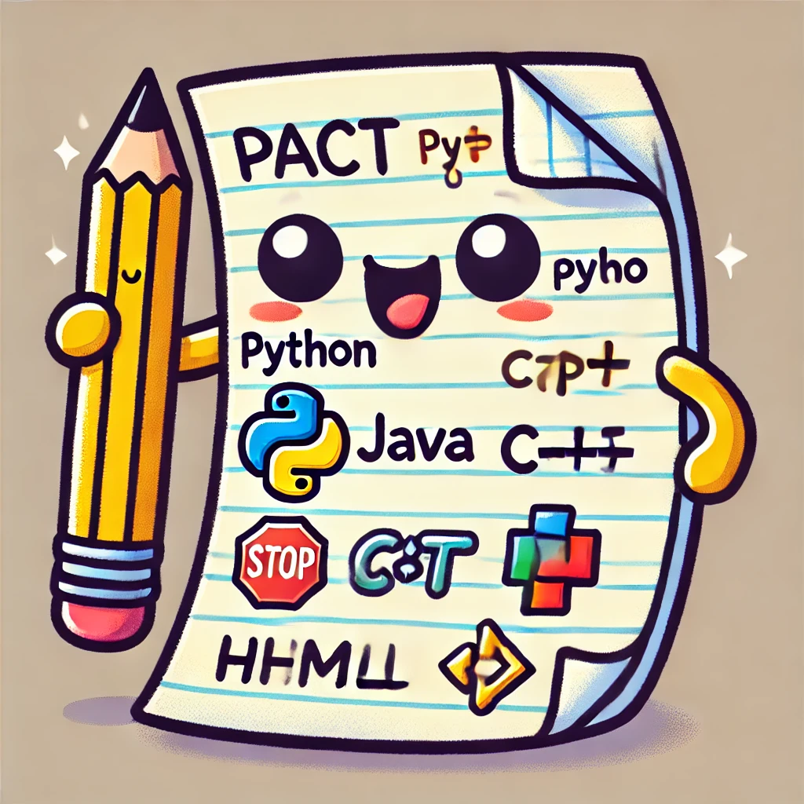

# Programming Assignment Creation Tool (PACT) 📄


PACT is a simple Github based tool designed to help streamline the process of creating, versioning, and distributing programming assignments.

<center>
    
</center>

## What is PACT? 📝
The core functionality of PACT is to provide a way to automatically convert
the "solution" form of a programming assignment into a version that is ready to
be distributed to students. To do this, PACT relies on a few keyword triggers that
are placed in the solution code. These triggers and the resulting behavior they
cause are highly customizable.


## Getting Started 🚀
This PACT repository is designed to be utilized as a starting template for a repository containing the assignments for your course. Since this repository will contain the solution versions of the assignments, it is recommended to keep it private to prevent students from accessing the solution code.

The easiest way to get started with PACT is to use this repository as a template.
1. Navigate to [github.com/bviggiano/pact](https://github.com/bviggiano/pact)
2. Click on the "Use this template" button, located above the file list and next to the "Code" button.
3. Select "Create a new repository"
4. On the repository creation page, choose a repository name (e.g., `CS101`) and set the visibility to `private`.


Finally, after you have your private repository set up, set up the pact conda environment by running the following commands from the root of the repository:
```bash
conda env create -f environment.yml
conda activate pact_env
pip install -e .
```

You can begin developing your assignments to the repository! Check out the [./pact/README.md](./pact/README.md) file for more information on how to use PACT to create assignments.


## Contributing 🤝
Contributions to PACT are welcome! Whether it's adding new features, fixing bugs, or improving documentation, all contributions are appreciated. 😁

## License 📝
This project is licensed under the MIT License - see the [LICENSE](LICENSE) file for details.

<center>
Happy Coding! 🚀
</center>

