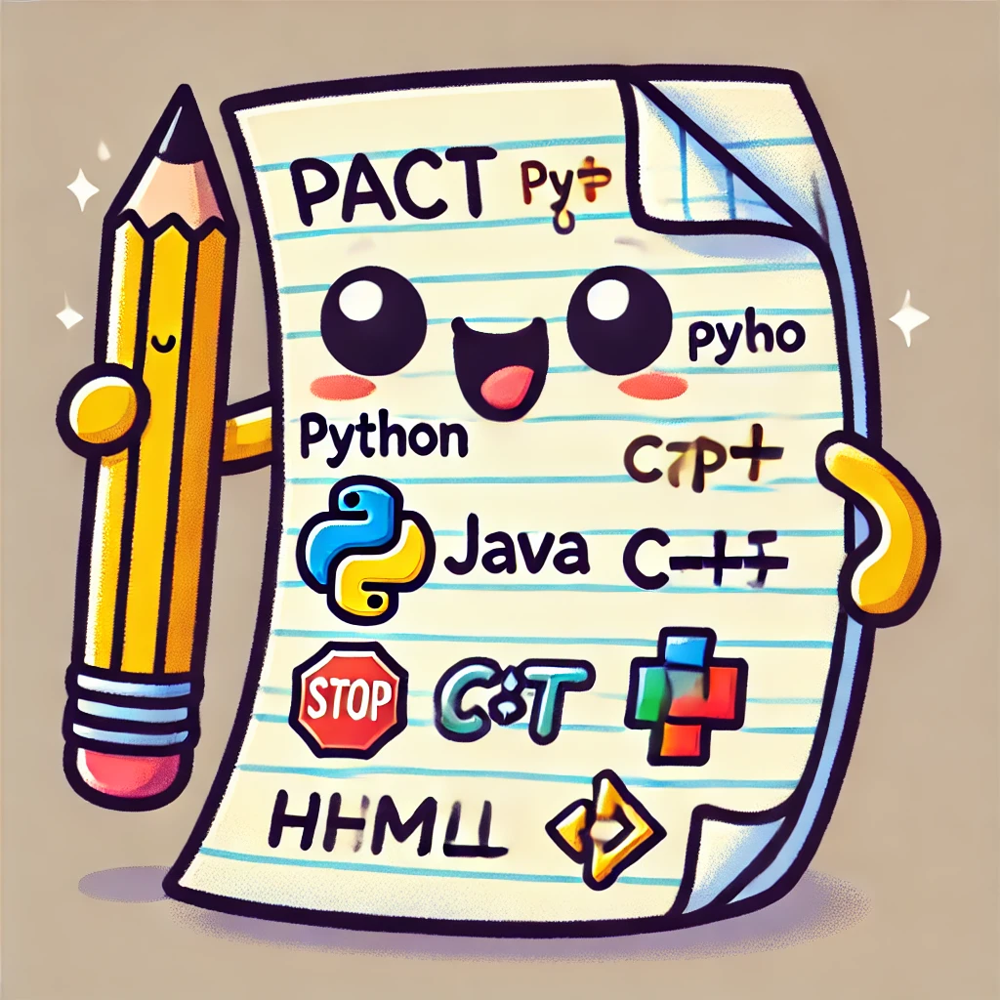

# Programming Assignment Creation Tool (PACT) 📄

<p align="center">
  <a href="https://github.com/bviggiano/pact/actions/workflows/assignment_release.yml"></a>
  <a href="https://www.python.org/downloads/"></a>
  <a href="https://github.com/bviggiano/pact/blob/main/LICENSE"></a>
  <a href="https://github.com/bviggiano/pact"></a>
</p>

<p align="center">
PACT is a simple Github based tool designed to help streamline the process of creating, versioning, and distributing programming assignments.
</p>

<p align="center">
    
</p>


## What is PACT? 📝

The core functionality of PACT is to provide a way to automatically convert the "solution" form of a programming assignment into a version that is ready to be distributed to students. To do this, PACT relies on a few keyword triggers that are placed in the solution code. These triggers and the resulting behavior they cause are highly customizable.


## Getting Started 🚀

This PACT repository is designed to be utilized as a starting template for a repository containing the assignments for your course.

> [!IMPORTANT]
> Since this repository will contain the solution versions of the assignments, it is recommended to keep it **private** to prevent students from accessing the solution code.

### 1. Create Your Repository

1. Navigate to [github.com/bviggiano/pact](https://github.com/bviggiano/pact)
2. Click on the **"Use this template"** button, located above the file list and next to the "Code" button
3. Select **"Create a new repository"**
4. On the repository creation page, choose a repository name (e.g., `CS101`) and set the visibility to **private**

### 2. Enable GitHub Actions Permissions

> [!WARNING]
> **The automated release workflow will fail with a 403 error until you complete this step.**

1. Go to your repository's **Settings** tab
2. In the left sidebar, click **Actions** → **General**
3. Scroll down to **Workflow permissions**
4. Select **Read and write permissions**
5. Click **Save**

> [!NOTE]
> **For GitHub Organizations**: If your repository is in an organization, you may need to enable this setting at the organization level first. Go to Organization Settings → Actions → General → Workflow permissions.

### 3. Set Up Local Environment

After configuring permissions, set up the PACT conda environment:

```bash
conda env create -f environment.yml
conda activate pact_env
pip install -e .
```

> [!TIP]
> Check out the [pact/README.md](./pact/README.md) file for detailed information on how to use PACT to create assignments, including trigger keywords and customization options.


## Contributing 🤝

Contributions to PACT are welcome! Whether it's adding new features, fixing bugs, or improving documentation, all contributions are appreciated. 😁

## License 📝

This project is licensed under the MIT License - see the [LICENSE](LICENSE) file for details.

<p align="center">
Happy Coding! 🚀
</p>
